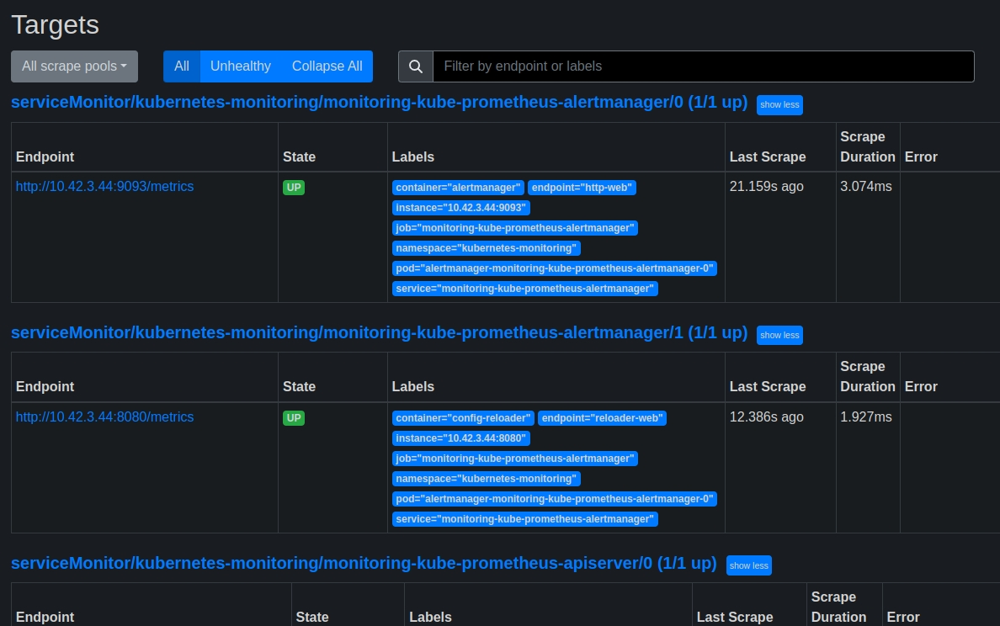

# kubernetes-monitoring
Grafana &amp; Prometheus Kubernetes Cluster Monitoring

* Create Namespace and Add Helm Charts Repo
The first step is to create a namespace in the Kubernetes cluster. It will establish a separate place in your Kubernetes cluster for the Prometheus and Grafana servers to be deployed into. To do so, run the following commands on the command line.
```bazaar
kubectl create namespace kubernetes-monitoring  
```
```bazaar
# Add Prometheus-community repo
helm repo add Prometheus-community \
https://prometheus-community.github.io/helm-charts

# To update the helm repo 
 helm repo update
```

* Deploying Helm Charts to Created Namespace
Run the helm install command below after adding the Helm repo to deploy the kube-prometheus stack Helm chart. Replace monitoring with the name of your choice.

By acting on a set of Custom Resource Definitions(CRDs), this Helm chart configures a comprehensive Prometheus Kubernetes monitoring stack. To deploy the chart to the Kubernetes cluster, run the following commands.

```bazaar
helm install monitoring prometheus-community/kube-prometheus-stack \
 --namespace kubernetes-monitoring --wait
```

run the following command to confirm your Kube-Prometheus stack deployment.
```bazaar
kubectl get pods -n kubernetes-monitoring
```

* Accessing the Prometheus Instance and Viewing the Internal State Metrics
After you’ve successfully deployed your Prometheus and Grafana instances to your Kubernetes cluster, the next step is to use them to monitor the cluster. To do this, we must enable traffic to the Prometheus pod to observe your cluster’s internal metrics. This will also enable you to access the Prometheus server from your browser. Run the following command to obtain the name of the Prometheus server to which you will be forwarding traffic to.

```bazaar
kubectl get svc -n kubernetes-monitoring
```

Next, run the below kubectl port-forward command to forward the local port 9090 to your cluster via the Prometheus service (svc/monitoring-kube-prometheus-prometheus). To do so run the following commands.

```bazaar
kubectl port-forward svc/monitoring-kube-prometheus-prometheus \
-n kubernetes-monitoring 9090
```

Open a web browser, and navigate to http://localhost:9090 to access your Prometheus instance.

To exit from the port forward session press ctrl c or command c The next thing is to view internal state metrics for the Prometheus kubernetes cluster and the kube-state-metrics (KMS) tool deployed with the helm chart stacks used. The Kube-state-metrics (KSM) tool allows you to view your Kubernetes cluster’s internal state metrics. The KSM tool allows you to monitor the health and consumption of your resources, as well as internal state objects. KSM can potentially display data points such as node metrics, deployment metrics, and pod metrics. The KSM tool is pre-packaged in the kube-prometheus stack and is immediately installed alongside the other monitoring components.

You’ll port-forward a local port to your cluster via the kube-state-metrics service. Doing so lets KSM scrape the internal system metrics of your cluster and output a list of queries and values.

To do so, run the following commands
```bazaar
# to check if the KMS Tools is running 
kubectl get svc -n kubernetes-monitoring | grep kube-state-metrics

kubectl port-forward svc/monitoring-kube-state-metrics -n kubernetes-monitoring 8080 
```

Open your browser and type http://localhost:8080 <br/>
Please keep in mind that if you get a permissions access issue when forwarding traffic to port 8080, you can use this option.
```bazaar
kubectl port-forward svc/prometheus-kube-state-metrics -n \
kubernetes-monitoring 8085:80 
```

Click on the metric and to view the metrics.

* Visualizing a Cluster’s Internal State Metric on Prometheus<br/><br/>
Now we will execute some Prometheus queries to see the internal state metrics of our kubernetes cluster. We will focus on CPU Utilization. Check The Prometheus site https://prometheus.io/docs/prometheus/latest/querying/basics/ for more on the Prometheus query language.

Run this command to be able to access to prometheus portal
```bazaar
kubectl port-forward svc/monitoring-kube-prometheus-prometheus \
-n kubernetes-monitoring 9090
```

Go to http://localhost:9090 and select from the Status menu the Targets option



As seen above, many Kubernetes internal and monitoring components are set as Prometheus targets on http://localhost:9090/targets 

Now, click on the graph icon in the top bar, enter the following commands in the search box to run the query, and then click on the graph bar below the search bar.
```bazaar
Sum by (cpu)(node_cpu_seconds_total{mode!="idle"})
```
or this one
```bazaar
cluster:node_cpu:sum_rate5m
```

* Monitoring and Visualizing with Grafana Dashboards

Prometheus visualization options are limited, only a Graph. Prometheus is great for collecting metrics from targets set as tasks, aggregating the metrics, and storing them locally on the workstation. However, when it comes to traditional resource monitoring adding in Grafana is a great option.

Metrics produced by server components such as node exporter, CoreDNS, and others are collected by Prometheus. Grafana obtains these metrics from Prometheus and displays them in a number of ways.

To get access to the Grafana dashboard we need to get the password and username:

```bazaar
kubectl get secret -n kubernetes-monitoring monitoring-grafana -o yaml
```

You will see a couple of lines containing the admin-password and the admin-user, decode those values with:

```bazaar
echo admin-password_value_taken_from_the_yaml | base64 --decode

echo admin-user_value_taken_from_the_yaml | base64 --decode
```

* The next step is to login into the grafana, firstly you must first direct traffic to the grafana server:
```bazaar
kubectl port-forward svc/monitoring-grafana -n kubernetes-monitoring 3001:80
```

In your browser, go to http://localhost:3001/ 

Next type the admin-username and password you have decoded to login.

First thing to do is to change the admin password, click on the icon in the upper right corner and select Change password.

Now to start monitoring, type this URL in your browser type http://localhost:3001/dashboards 


The picture above depicts preconfigured dashboards that come with the Kube-Prometheus stack.

Now click on the kubernetes/compute Resources/Cluster


This dashboard shows the CPU usage, CPU request commitment, limitations, memory usage, memory request commitment, and memory limit commitment. It will help you manage and monitor them.

Follow the same steps to select dashboards for Kubernetes resources you want to manage and monitor.
